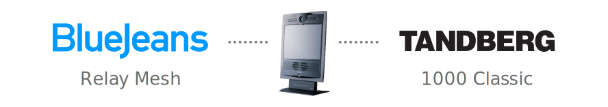
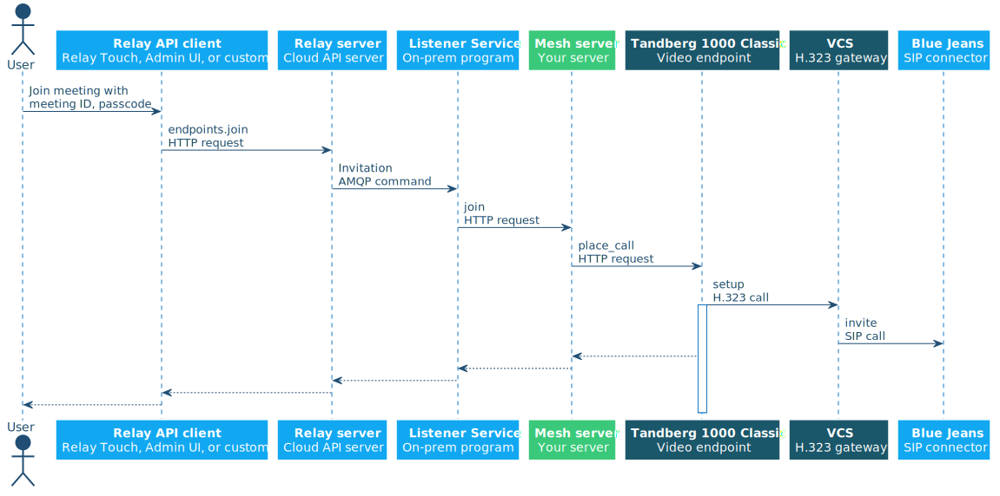
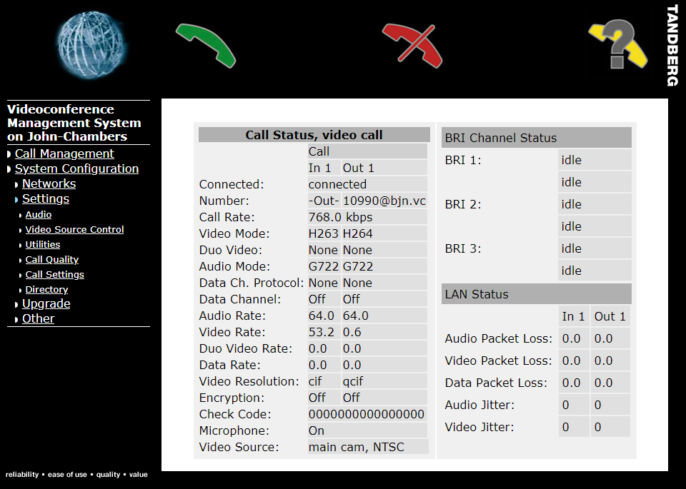

This server allows you to control a [Tandberg 1000 Classic](https://www.cnet.com/products/tandberg-1000-video-conferencing-kit-series/specs/) video conferencing endpoint using [**Blue Jeans Relay**](https://www.bluejeans.com/features/relay). Relay does not have build-in support for the Tandberg 1000 Classic because this endpoint is old and outdated, but thanks to the extensible [**Relay Mesh**](https://relay.bluejeans.com/docs/mesh.html) Control Protocol, anyone can easily extend Relay to support other endpoints like this one.

This repository serves as a reference implementation of the Mesh server interface. It successfully controls a real endpoint from Relay. You may use this repo as a starting point for developing a Mesh server for your own endpoints. This particular server is written in Java, but you can use any language that can run an HTTP server.

---

<!-- MarkdownTOC autolink="true" bracket="round" autoanchor="true" depth="4" -->

- [What is Relay Mesh?](#what-is-relay-mesh)
    - [Why does Mesh exist?](#why-does-mesh-exist)
    - [Requirements](#requirements)
- [Usage](#usage)
    - [Installation](#installation)
    - [Configuration](#configuration)
        - [Relay configuration](#relay-configuration)
        - [H.323 gateway configuration (optional)](#h323-gateway-configuration-optional)
            - [Cisco Video Communications Server (VCS)](#cisco-video-communications-server-vcs)
- [Development](#development)
    - [Request path](#request-path)
    - [Programmatically controlling a Tandberg 1000 Classic](#programmatically-controlling-a-tandberg-1000-classic)
    - [Codebase starting points](#codebase-starting-points)
    - [Libraries](#libraries)
    - [Testing](#testing)

<!-- /MarkdownTOC -->

---

<a name="what-is-relay-mesh"></a>
## What is Relay Mesh?

**Relay** is a video conferencing endpoint control system created by [Blue Jeans](https://www.bluejeans.com/). It lets you synchronize your calendars to endpoints, join scheduled Blue Jeans meetings with one touch, and control the endpoints from a tablet or any [API](https://relay.bluejeans.com/docs/) client. It supports a [bunch of different endpoints already](https://swdl.bluejeans.com/relay/docs/Requirements.pdf).

**Relay Mesh** is an HTTP interface that allows Relay to integrate with otherwise unsupported endpoints. If you create an HTTP server that implements this interface and controls your endpoints, then Relay will be able to control your endpoints.

See the [**Relay API docs**](https://relay.bluejeans.com/docs/mesh.html) for more details and API specifications for Mesh.

<a name="why-does-mesh-exist"></a>
### Why does Mesh exist?

Imagine you're already using Relay to attend your scheduled and ad-hoc meetings on your Cisco, Lifesize, Polycom, StarLeaf, Tely, or Sony video conferencing endpoints using their built-in calendar interface, the Relay Touch Android or iOS apps, or a custom API client integration. LIfe is good, and joining meetings is easy.

Now you want to do the same thing with a different kind of endpoint, one that Relay doesn't natively support. You could, in theory, write a web server that controlled your endpoint, make it imitate the admin interface of a Polycom endpoint (for example), and then provision it in Relay using a Polycom Control Protocol. Unfortunately, that's not a perfect solution, because it's a decent amount of work for you to figure out how to spoof a Polycom API, and the way a Listener Service controls a Polycom endpoint might change, leaving your fake endpoint broken.

To solve this, Relay allows you to provision an endpoint using a very generic, stable Control Protocol called Mesh. It's not vendor-specific, and it's very easy to implement. All you have to do is expose an HTTP server like this one that conforms to the Mesh interface, and then make it control your specific endpoint using whatever admin interface the endpoint offers.

<a name="requirements"></a>
### Requirements
- [Blue Jeans Relay](http://bluejeans.com/features/relay#relay) account and Listener Service
    - [Requirements](https://swdl.bluejeans.com/relay/docs/Requirements.pdf)
    - [Getting Started guide](https://swdl.bluejeans.com/relay/docs/Getting%20Started.pdf)
- [Java SE Development Kit &ge; 7](http://www.oracle.com/technetwork/java/javase/downloads/index.html)
- [Maven](http://maven.apache.org/)

<a name="usage"></a>
## Usage

<a name="installation"></a>
### Installation

    git clone https://github.com/bluejeans/relay-mesh-tandberg-1000-classic.git
    cd relay-mesh-tandberg-1000-classic
    mvn compile exec:java  

The Mesh web server will compile and run, listening on port `6374`. Requests will be parsed and logged.

<a name="configuration"></a>
### Configuration

<a name="relay-configuration"></a>
#### Relay configuration

1. Log in to the [Relay administrative site](https://relay.bluejeans.com/)
1. Create a new **Endpoint**
1. Give the Endpoint a **Name**
1. Choose an existing **Listener Service** that can connect to your Mesh server
1. Set the **Control Protocol** to Relay Mesh
1. Set the **Mesh Base URI** to the URI of your Mesh server, _e.g._ `http://192.168.1.100:6374/`
1. Set the **IP Address** to your Tandberg 1000 Classic's LAN IP address
1. Set the **Password** to your Tandberg 1000 Classic's IP password, if one is set

Now you should be able to make the endpoint start dialing by clicking the **Join** link and supplying a meeting ID, like `415123456`.

<a name="h323-gateway-configuration-optional"></a>
#### H.323 gateway configuration (optional)

**Warning: these steps are silly.** If all you care about is seeing how Mesh works, and you don't actually need to make a Tandberg 1000 Classic successfully dial into a Blue Jeans meeting with a passcode behind a NAT, then you don't actually have to set up an H.323 gateway. **Setting up a gateway for your ancient endpoint is only good for personal satisfaction and bragging rights.**

---

On its own, the Tandberg 1000 Classic has a few limitations.
* No NAT traversal, so it can't make outbound calls to the WAN if it's behind a NAT
* Dial strings cannot contain `.` in the local part of a URI, so it can't send a meeting passcode to Blue Jeans.

To be fair, it reached end-of-life in 2004, so it's not exactly new.

If you want to, you can solve these problems by putting the endpoint in a DMZ and only dialing into passcodeless meetings, but that solution is insufficiently complex. Instead, we can use an H.323 gateway, such as a Cisco VCS, to solve both of these problems.

<a name="cisco-video-communications-server-vcs"></a>
##### Cisco Video Communications Server (VCS)

1. Enable H.323 and interworking.
1. Create a DNS zone for `bjn.vc`.
1. Create a dial plan search rule that performs an alias pattern match on meetings with passcodes using the regex 
    ```
    ^(\d{5,})[\*\.](\d{4,})@(?:sip\.)?bjn\.vc
    ```
    replacing the match with
    ```
    \1.\2@bjn.vc
    ```
    and targeting the DNS zone you created.
1. Make a second copy of this dial plan with the pattern 
    ```
    ^(\d{5,})@(?:sip\.)?bjn\.vc
    ```
    to handle passcodeless meetings.
1. Register the endpoint to the VCS. You can do this from the on-screen menu or from the endpoint's web interface: under System Configuration &rsaquo; Networks &rsaquo; H.323 Settings, specify the manual gatekeeper IP of your VCS.
1. In the Relay administrative site, create a new [Dial Style](https://relay.bluejeans.com/#dialstyles) with a **Format with Passcode** of
    ```
    {meetingid}*{passcode}@{host}
    ```
    and a **Format without Passcode** of 
    ```
    {meetingid}@{host}
    ```
1. Set the Tandberg 1000 Classic Endpoint in Relay to use this **Dial Style**
1. Set the Endpoint in Relay to use Hostname as the **Address Style**

After all that shenanigans, you can dial again, and Relay will use an asterisk in the dial string to separate the meeting ID and passcode, instead of a period like standard Annex-O, which allows the endpoint to not barf on the dial string. When the VCS receives the call, it will restore the Annex-O dial string, convert the call signaling from H.323 to SIP, send it to Blue Jeans, and receive inbound traffic even if there is a NAT.

<a name="development"></a>
## Development

<a name="request-path"></a>
### Request path



The same path is used for all Mesh methods.

<a name="programmatically-controlling-a-tandberg-1000-classic"></a>
### Programmatically controlling a Tandberg 1000 Classic 

The Tandberg 1000 Classic serves an administrative web interface on port 80, protected by Digest authentication. From this interface, you can join a meeting, check the status, hang up, and perform other configuration tasks. This Mesh server uses the endpoint's web interface to let Relay control the endpoint.



One task that isn't exposed in the endpoint's web interface is muting and unmuting the microphone. However, it is exposed in the Telnet API. Therefore, this Mesh server uses Telnet, but only for muting and unmuting the endpoint's microphone.

    $ telnet 10.4.5.104
    Welcome to John-Chambers
    TANDBERG Codec Release E2.3 NTSC
    SW Release Date: 2003-10-20

    Password:
    OK
    mic off

    OK
    bye

<a name="codebase-starting-points"></a>
### Codebase starting points

The Mesh server interface is implemented in `src/main/java/vc/bjn/catalyst/tandberg1000classicmesh/api/EndpointControlResource.java`. This is the Listener Service's entry point into your server.

The endpoint client is implemented in `src/main/java/vc/bjn/catalyst/tandberg1000classicmesh/dispatcher/Tandberg1000ClassicDispatcher.java`. This is what your server uses to control your endpoint.

<a name="libraries"></a>
### Libraries

The Mesh server uses the [Jersey framework](https://jersey.github.io/) running on a [Grizzly](https://javaee.github.io/grizzly/) HTTP server. Dependencies are injected using [HK2](https://javaee.github.io/hk2/).

The endpoint client uses a [Jersey client](https://jersey.github.io/documentation/latest/client.html) with the built-in [HttpURLConnection](https://docs.oracle.com/javase/7/docs/api/java/net/HttpURLConnection.html) connector. The client also uses the [Apache Commons Net](http://commons.apache.org/proper/commons-net/) [TelnetClient](http://commons.apache.org/proper/commons-net/apidocs/org/apache/commons/net/telnet/TelnetClient.html) for toggling the endpoint's microphone mute state, which is unavailable from the web interface.

Logging is handled by [SLF4J](https://www.slf4j.org/)/[Logback](https://logback.qos.ch/). JSON is handled by [Jackson](https://github.com/FasterXML/jackson).

<a name="testing"></a>
### Testing

Tests are located in `src/test/java` and can be run from the Maven command line with `mvn test` or through your IDE with TestNG.

If you want requests to pass through a debugging proxy like [Fiddler](https://www.telerik.com/fiddler) or [Charles](https://www.charlesproxy.com/), you can use VM arguments or compile-time properties. See [Configure a Java Application to Use Fiddler](http://docs.telerik.com/fiddler/Configure-Fiddler/Tasks/ConfigureJavaApp) for details.